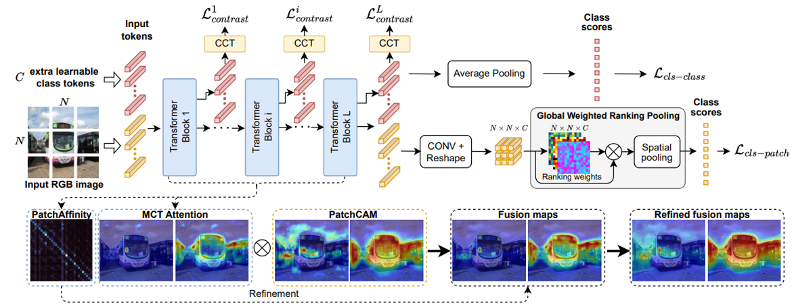
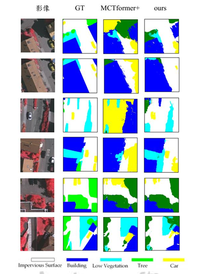
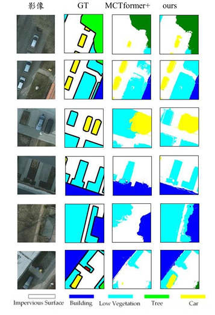
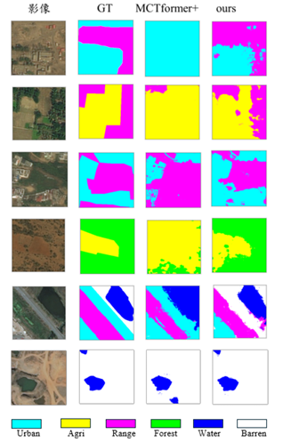

# References - MCTformer+
The pytorch code for [Multi-class Token Transformer for Weakly Supervised Semantic Segmentation](https://arxiv.org/abs/2203.02891) (MCTformer, CVPR 2022) and its journal extension MCTformer+ (IEEE TPAMI 2024, vol. 46, no. 12, pp. 8380-8395).

[[MCTformer Paper]](https://arxiv.org/abs/2203.02891) [[Original repo]](https://github.com/xulianuwa/MCTformer)
> If you need to train or reproduce vanilla MCTformer / MCTformer+, please rely on the original repo's docs and training scripts.

<p align="center">
  
</p>
<p align = "center">
Fig.1 - Overview of MCTformer+
</p>

---

# GPR: Gated Pixel-level Residual for Remote Sensing WSSS (on top of MCTformer+)

This repository contains our GPR implementation and utilities to:
- train MCTformer+ with the GPR module inserted before patch embedding,
- generate CAMs,
- evaluate the CAM seed against pixel-level ground truth (with CRF refinement) and export CRF-refined pseudo labels for training a downstream segmentation model.

> **Note🔎**
> If you need to **train or reproduce vanilla MCTformer+** (without GPR), just drop `--use-pixel-residual` and the other `--pr-*` flags from the commands below.

GPR injects multi-scale pixel-level context (three parallel convolution branches: 1×1 / 3×3 / 5×5) via a learnable-gated additive residual, immediately before the patch-embedding layer. Small / texture-similar objects (cars, low vegetation vs. trees) get better CAM localization, at the cost of only **3,754 extra parameters (+0.017%)** over the MCTformer+ backbone.

## Prerequisite
- Ubuntu 20.04, with Python 3.10.13 and the following python dependencies.
```bash
pip install -r requirements.txt
```
- Download the ISPRS Vaihingen / Potsdam 2D Semantic Labeling benchmarks (registration required via the ISPRS benchmark portal) and [DeepGlobe Land Cover Classification](https://competitions.codalab.org/competitions/18468) as needed.

---

# GPR step

## Complete folder format

`data/` is a **sibling** of this repo, not a subfolder inside it (all scripts reference it as `../data/...`):

```text
parent/
├─ GPR/                 ← this repo
└─ data/
```

```text
data/
├─ Vaihingen/
│  ├─ cls_labels.npy
│  ├─ train_id.txt
│  ├─ val_id.txt
│  └─ voc12/VOCdevkit/VOC2012/
│     ├─ JPEGImages/
│     └─ SegmentationClass/
├─ Postdam/            (same layout, RGB tiles)
├─ Postdam_IRRG/       (same layout, IRRG tiles; shares labels with Postdam/)
└─ DeepGlobe/           (same layout, 6-class land cover)
```

Pixel-level `SegmentationClass` masks are used only for evaluation, never for training — this is a WSSS pipeline trained purely on image-level labels (`cls_labels.npy`).

#### Main Result
mIoU of the CAM pseudo-label seed, MCTformer+ (baseline) vs. **+ GPR**:

<table>
  <thead>
    <tr>
      <th style="text-align:center;">Dataset</th>
      <th style="text-align:center;">Baseline mIoU</th>
      <th style="text-align:center;">+ GPR mIoU</th>
      <th style="text-align:center;">Δ</th>
      <th style="text-align:center;">Weights</th>
    </tr>
  </thead>
  <tbody>
    <tr>
      <td style="text-align:center;">ISPRS Vaihingen (IRRG)</td>
      <td style="text-align:center;">40.92</td>
      <td style="text-align:center;">49.04</td>
      <td style="text-align:center;">+8.12</td>
      <td style="text-align:center;"><a href="https://drive.google.com/drive/folders/1nRCw_kT9Un-9jai9cTWw6U0Z-7Im0spF?usp=drive_link">Google Drive</a></td>
    </tr>
    <tr>
      <td style="text-align:center;">ISPRS Potsdam (RGB)</td>
      <td style="text-align:center;">63.21</td>
      <td style="text-align:center;">65.46</td>
      <td style="text-align:center;">+2.25</td>
      <td style="text-align:center;"><a href="https://drive.google.com/drive/folders/1nRCw_kT9Un-9jai9cTWw6U0Z-7Im0spF?usp=drive_link">Google Drive</a></td>
    </tr>
    <tr>
      <td style="text-align:center;">ISPRS Potsdam (IRRG)</td>
      <td style="text-align:center;">60.58</td>
      <td style="text-align:center;">62.72</td>
      <td style="text-align:center;">+2.14</td>
      <td style="text-align:center;">—</td>
    </tr>
    <tr>
      <td style="text-align:center;">DeepGlobe (6-class)</td>
      <td style="text-align:center;">76.41</td>
      <td style="text-align:center;">77.36</td>
      <td style="text-align:center;">+0.95</td>
      <td style="text-align:center;"><a href="https://drive.google.com/drive/folders/1nRCw_kT9Un-9jai9cTWw6U0Z-7Im0spF?usp=drive_link">Google Drive</a></td>
    </tr>
  </tbody>
</table>

> The Drive folder contains one subfolder per experiment (`{dataset}_baseline/`, `{dataset}_pr_ni_lr1/`), each holding `checkpoint.pth`. Potsdam IRRG checkpoints are not released. Drop a folder's `checkpoint.pth` under `saved_model/<name>/` and pass it to `--resume` to skip training and go straight to CAM generation.

See the thesis for per-class IoU, FP/FN rates, and confusion matrices.

#### Qualitative Results

<p align="center">
  
</p>
<p align="center">
  
</p>
<p align="center">
  
</p>

---

### Train (GPR)
Example: ISPRS Vaihingen, GPR default (1,3,5) kernels, instance norm.
```text
python main.py \
--data-set Vaihingen --img-list ../data/Vaihingen \
--data-path ../data/Vaihingen/voc12/VOCdevkit/VOC2012 \
--label-file-path ../data/Vaihingen/cls_labels.npy \
--output_dir saved_model/vaihingen_gpr \
--finetune https://dl.fbaipublicfiles.com/deit/deit_small_patch16_224-cd65a155.pth \
--input-size 448 --batch-size 32 \
--use-pixel-residual --pr-norm instance
```

<details>
<summary>🔧 Arguments</summary>

- --data-path  Dataset root (contains voc12/VOCdevkit/VOC2012/…)
- --img-list   Directory holding the image ID lists (train_id.txt / val_id.txt)
- --label-file-path  Image-level classification labels (cls_labels.npy)
- --output_dir  Where logs/checkpoints are saved
- --finetune    Init weights (ImageNet-pretrained DeiT-Small)
- --use-pixel-residual  Enable GPR (single-layer PixelResidualStem)
- --pr-kernels K  Largest branch kernel size (default 5 → branches (1,3,5); also 7/9 for the kernel-size ablation)
- --pr-norm {instance,batch,group,none}  Normalization on the GPR correction term (default instance)
- --pr-lr-mult  LR multiplier for the GPR param group (default 1.0)
- --pr-13 / --pr-strip  Branch-shape ablation variants (mutually exclusive, --pr-13 takes priority) — see Ablation experiments below
- --batch-size / --epochs / --input-size  Usual training knobs (defaults: epochs=45, input-size=448)
</details>

#### Notes🔎
- `--pr-kernels` (and `--pr-13` / `--pr-strip`) must be **identical** between the training run and the corresponding `--gen_attention_maps` run below, or `load_state_dict` will fail on shape mismatch.
- After training, `--output_dir` contains `checkpoint.pth`; use it as `--resume` when generating CAMs.

---

### Generate attention maps
```text
python main.py --data-set VaihingenMS \
--img-list ../data/Vaihingen \
--data-path ../data/Vaihingen/voc12/VOCdevkit/VOC2012 \
--label-file-path ../data/Vaihingen/cls_labels.npy \
--output_dir saved_model/vaihingen_gpr \
--resume saved_model/vaihingen_gpr/checkpoint.pth \
--gen_attention_maps --layer-index 12 \
--cam-npy-dir saved_model/vaihingen_gpr/cam-npy-layer12 \
--use-pixel-residual --pr-norm instance
```

<details>
<summary>🔧 Arguments</summary>

- --data-set  Use the `*MS` variant (multi-scale + flip) for CAM generation
- --resume    Load the trained checkpoint from the Train step
- --cam-npy-dir  Where the generated CAMs (.npy) are written
- --gen_attention_maps  Enable CAM generation mode (no training)
- --layer-index  Transformer block used for CAM extraction (12 = last layer)
- --use-pixel-residual / --pr-*  Must match the Train step exactly
</details>

---

### Verify the results / generate pseudo labels
Unlike VOC (which needs a threshold sweep against a competing background class), our ISPRS/DeepGlobe setup has **no background class** — the 5/6 foreground classes tile the whole image, so the optimal threshold is always 0 (equivalent to plain argmax). We therefore evaluate directly at `--t 0` and write the CRF-refined pseudo mask in the same command:
```text
python evaluation.py --list ../data/Vaihingen/train_id.txt \
--gt_dir ../data/Vaihingen/voc12/VOCdevkit/VOC2012/SegmentationClass \
--img_dir ../data/Vaihingen/voc12/VOCdevkit/VOC2012/JPEGImages \
--predict_dir saved_model/vaihingen_gpr/cam-npy-layer12 \
--type npy --t 0 --num_classes 5 --dataset vaihingen --no-background \
--out-crf --out-dir saved_model/vaihingen_gpr/pseudo-mask-crf-layer12 \
--logfile saved_model/vaihingen_gpr/cam-npy-layer12/evallog.txt \
--comment vaihingen_gpr_layer12
```

<details>
<summary>🔧 Arguments</summary>

- --predict_dir  Same path as --cam-npy-dir from the previous step
- --gt_dir / --img_dir  Ground-truth masks / original images (img_dir only needed for CRF)
- --t  Fixed foreground threshold (0 for our no-background remote sensing datasets; use `--curve True` instead to sweep thresholds, e.g. for VOC-style datasets with a background class)
- --no-background  This dataset has no background class (all pixels belong to one of the foreground classes)
- --out-crf --out-dir  Apply CRF refinement and write the resulting pseudo label masks
- --dataset  Category-name / colormap set for the printed report (`vaihingen` / `postdam` / `deepglobe`)
</details>

The resulting pseudo masks in `--out-dir` are what you'd feed into a fully-supervised segmentation model (we used DeepLab v2) for the second WSSS stage.

---

## Ablation experiments
Every ablation below follows the same three-step pipeline as above; the ready-made scripts just wire up the right flags for you (run from inside `GPR/`, e.g. `bash run_vaihingen_ablation_norm.sh`):

| Script | Ablation | Thesis table |
|---|---|---|
| `run_{vaihingen,postdam,deepglobe}.sh` | Baseline (no GPR) | Tables 3–5 |
| `run_{vaihingen,postdam,deepglobe}_pr.sh` | + GPR default (1,3,5), instance norm, lr×1 | Tables 3–5 |
| `run_{vaihingen,postdam,deepglobe}_ablation_norm.sh` | Normalization: instance / batch / group / none | Table 1 |
| `run_{vaihingen,postdam}_full.sh` | norm × lr-mult × Stacked/Multi-stage grid | Table 2, 13–14 |
| `run_{vaihingen,postdam,deepglobe}_k13.sh` | `(1,3)` — drop the 5×5 branch | Tables 9–11 |
| `run_{vaihingen,postdam,deepglobe}_strip5.sh` | Depthwise-separable 5×5 (SegNeXt-style; `--pr-strip`, "strip5" in the thesis text) | Table 12 |
| `run_postdam_irrg_{baseline,pr}.sh` | Potsdam IRRG variant | Table 16 |

Findings (see thesis §4.5 for full tables/discussion):
- **Kernel combo** `(1,3,5)` beats `(1,3)`, `(1,3,7)`, `(1,3,9)` on all three datasets — the 5×5 branch is necessary, but going larger crosses the 16×16 patch boundary and hurts.
- **Branch shape**: depthwise-separable `strip5` matches `(1,3,5)` on Vaihingen/DeepGlobe but collapses Potsdam Car IoU (55.6→5.2) — Potsdam needs *dense* cross-channel mixing at the 5px scale, not just a separable approximation of the receptive field.
- **Layer count**: single-layer GPR beats both `Stacked ×2` and `Multi-stage` on all three datasets — more capacity is not better.
- **Normalization**: `instance` is the only setting that's positive on all three datasets; `group` wins individually on Vaihingen/DeepGlobe but regresses -2.46 on Potsdam.

---

## Citation

If you use this code, please cite the underlying MCTformer+ paper:

```
L. Xu, M. Bennamoun, F. Boussaid, H. Laga, W. Ouyang, and D. Xu,
"MCTformer+: Multi-class token transformer for weakly supervised semantic segmentation,"
IEEE TPAMI, vol. 46, no. 12, pp. 8380-8395, 2024.
```

---

## Contact

If you have any questions, you can either create issues or contact us by email
[cyculab618@gmail.com](mailto:cyculab618@gmail.com)
